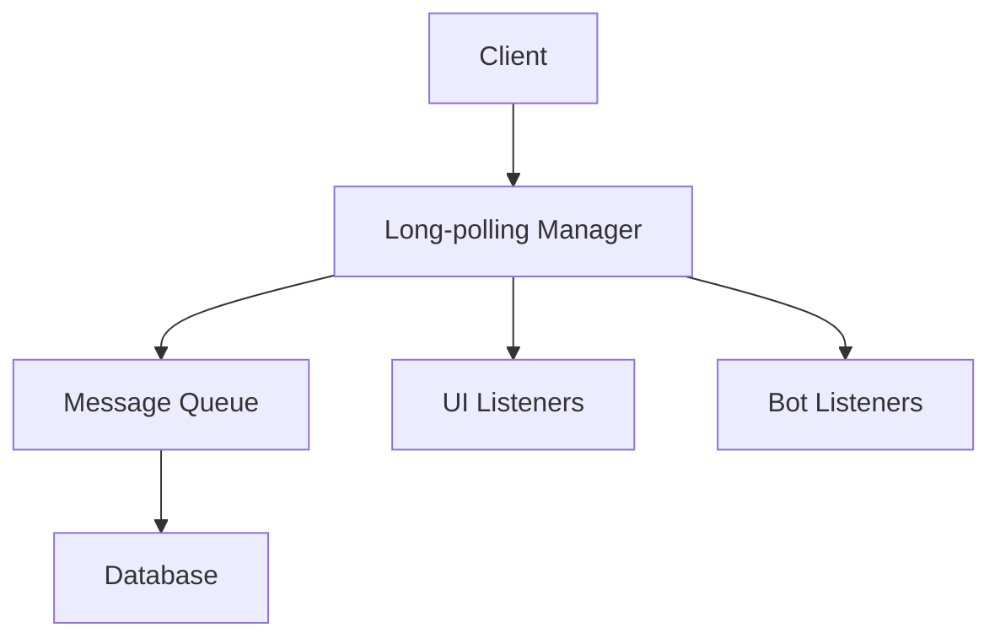

# Long-polling Architecture

# Overview
The long-polling system enables real-time updates for clients by keeping connections open until new messages are available. It's a core feature for both UI and bot listeners.

# Scope
- Long-polling endpoint: `/api/v1/getUpdates`
- Listener management
- Message routing based on listener type

# Component Diagram


# File Structure
```
src/
  helpers/
    logpollManager.ts - Core long-polling implementation
    index.ts - Registers long-polling endpoint
```

# How It Works
1. Clients connect to `/api/v1/getUpdates` with a timeout parameter
2. The server holds the connection open until:
   - New messages arrive that match the listener's criteria
   - The timeout is reached
3. Messages are routed based on:
   - `listenerType` (ui or bot)
   - `botIds` parameter for bot listeners

# Key Components
- **Long-polling Manager** (Location: `src/helpers/logpollManager.ts`)
  - Manages active connections
  - Implements the waitForMessages function
  - Handles message routing based on listener type

- **API Endpoint** (Location: `src/index.ts`)
  - `/api/v1/getUpdates` endpoint
  - Parameter validation
  - Connection timeout handling

# Integration with Main System
- Receives messages from the database via Prisma
- Notifies clients of new messages
- Works alongside the REST API for message management

# Data Flow
1. Message is added to the database
2. Long-polling manager checks if any listeners match the message criteria
3. Matching listeners are notified
4. Connection is closed and client must reconnect for new updates

# Configuration
- Timeout parameter (default: 60000ms)
- Listener type (ui or bot)
- Bot IDs for bot listeners

# Testing
- Not explicitly documented
- Likely tested via integration tests

# Common Issues & Troubleshooting
- Stale connections: Ensure timeout is set appropriately
- Missing updates: Verify listener parameters match message criteria
- High memory usage: Monitor active connections and adjust timeouts if needed

# See Also
- ARCH.md for overall system architecture
- ARCH_message-handling.md for message processing details