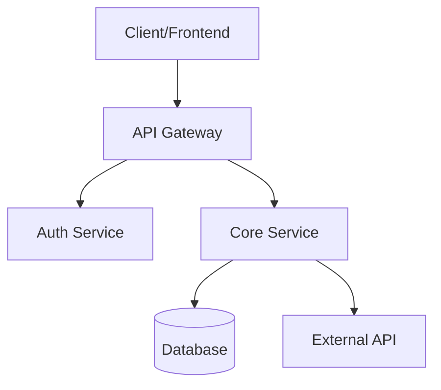

# Architecture Documentation

# Table of Contents
1. [Project Overview](#1-project-overview)
2. [System Architecture Diagram](#2-system-architecture-diagram)
3. [Project Structure](#3-project-structure)
4. [Core Frameworks & Their Usage](#4-core-frameworks--their-usage)
5. [Data Architecture](#5-data-architecture)
6. [Integration Points](#6-integration-points)
7. [Code Style & Conventions](#7-code-style--conventions)
8. [Security Considerations](#8-security-considerations)
9. [Dependency Management](#9-dependency-management)
10. [Setup & Build Process](#10-setup--build-process)
11. [Testing Strategy](#11-testing-strategy)
12. [Deployment](#12-deployment)
13. [Development Workflow](#13-development-workflow)
14. [Known Issues & Technical Debt](#14-known-issues--technical-debt)
15. [Future Considerations](#15-future-considerations)
16. [Glossary](#16-glossary)
17. [Appendix: File Reference](#17-appendix-file-reference)

---

# 1. Project Overview

## 1.1 Purpose and Goals
The ChatLayer Web UI provides a user interface for interacting with the ChatLayer backend service. It allows users to manage multiple chat bots, rooms, and messages in real-time. The application is designed to be responsive and work across different devices.

## 1.2 High-Level Architecture
The application follows a client-server architecture with a single-page application (SPA) frontend that communicates with a RESTful API backend. The frontend is built with Vue.js and uses Pinia for state management. Real-time updates are handled through long-polling via the ChatLayer SDK.

## 1.3 Technology Stack

**Core Technologies**:
- Language: TypeScript ~5.9.3
- Framework: Vue.js 3.5.22 with Ionic 8.7.8
- Runtime: Node.js 20.x
- Build Tool: Vite 7.1.12

**Key Dependencies**:
- Pinia 3.0.3: State management
- Axios 1.13.1: HTTP client
- Vue Router 4.6.3: Routing
- Vue i18n 11.1.12: Internationalization
- Luxon 3.7.2: Date/time handling
- localforage: Local storage

**Infrastructure**:
- Hosting: Static hosting (Netlify, Vercel, etc.)
- Database: None (state is managed client-side)
- Cache: localforage for offline persistence

---

# 2. System Architecture Diagram



The diagram shows the main components of the system:
- Client/Frontend: The Vue.js application
- API Gateway: The ChatLayer backend service
- Auth Service: Handles authentication
- Core Service: Manages chat bots, rooms, and messages
- Database: Stores persistent data
- External API: Third-party services integrated

---

# 3. Project Structure

```
project-root/
├── src/
│   ├── components/     - UI components and views
│   │   ├── AuthModal.vue - Authentication modal
│   │   ├── ChatList.vue - Chat list component
│   │   ├── ChatView.vue - Chat view component
│   │   ├── LanguagePicker.vue - Language selector
│   │   └── SettingsModal.vue - Settings modal
│   ├── services/       - API and utility services
│   │   └── api.ts - HTTP service
│   ├── stores/         - Pinia stores
│   │   └── uiStore.ts - Main application state
│   ├── helpers/        - Utility functions
│   │   └── notificationManager.ts - Notification handling
│   ├── locales/        - Internationalization resources
│   ├── theme/          - CSS variables and styles
│   ├── router/         - Vue Router configuration
│   └── main.ts         - Application bootstrap
├── tests/              - Test suites
│   ├── e2e/            - End-to-end tests
│   └── unit/           - Unit tests
└── config/             - Configuration files
```

## 3.1 Core Modules

**Module: uiStore (Location: `src/stores/uiStore.ts`)**
- **Purpose**: Manages application state including bots, rooms, messages, and UI settings
- **Key Files**:
  - `uiStore.ts` - Main state management
- **Dependencies**: ChatLayer SDK, localforage, Vue i18n
- **Used By**: All components that need to access or modify application state

**Module: api (Location: `src/services/api.ts`)**
- **Purpose**: Handles all HTTP communication with the backend
- **Key Files**:
  - `api.ts` - Axios instance and API methods
- **Dependencies**: Axios
- **Used By**: uiStore, components that need to make API calls

---

# 4. Core Frameworks & Their Usage

## 4.1 Vue.js
- **Version**: 3.5.22
- **Usage Pattern**: Standard with Composition API
- **Deviations from Conventional Use**:
  - Uses Ionic components for UI
  - Uses Pinia instead of Vuex for state management

## 4.2 Pinia
- **Version**: 3.0.3
- **Usage Pattern**: Standard
- **Deviations from Conventional Use**:
  - None

---

# 5. Data Architecture

## 5.1 Data Models
The application uses a simple data model with three main entities:
- Bot: Represents a chat bot
- Room: Represents a chat room
- Message: Represents a chat message

## 5.2 Database Schema
The application doesn't use a traditional database. Data is stored in:
- localforage: For offline persistence of application state
- Memory: For runtime state

## 5.3 Data Flow
1. User interacts with the UI
2. UI components dispatch actions to the uiStore
3. uiStore makes API calls to the backend via the api service
4. Backend responds with data
5. uiStore updates state and UI components react to changes

## 5.4 State Management
- Pinia is used for centralized state management
- State is persisted to localforage for offline support
- Real-time updates are handled via long-polling

---

# 6. Integration Points

## 6.1 External APIs
- **ChatLayer SDK**: Used for real-time communication with the backend
- **Ionic**: Used for UI components

## 6.2 Authentication & Authorization
- **Method**: API key stored in localStorage
- **Implementation**: (see: `src/components/AuthModal.vue`)
- **Flow**:
  1. User enters API key in AuthModal
  2. Key is stored in localStorage
  3. Subsequent requests include the key in the Authorization header

## 6.3 Inter-Component Communication
- Vue's reactivity system and Pinia are used for state management
- Components communicate via props and events
- Global events are used for cross-component communication (e.g., authRequired)

---

# 7. Code Style & Conventions

## 7.1 Formatting Rules
- **Linter**: ESLint with recommended rules
- **Config**: `.eslintrc.js`
- **Key Rules**:
  - Use TypeScript
  - Prefer const over let
  - Use camelCase for variables and functions
  - Use PascalCase for components

## 7.2 Naming Conventions
- **Files**: kebab-case
- **Functions**: camelCase
- **Classes**: PascalCase
- **Constants**: UPPER_SNAKE_CASE

## 7.3 Code Organization Patterns
- Feature-based folder structure
- Single file per component
- Separation of concerns

---

# 8. Security Considerations

## 8.1 Authentication & Authorization
- API key is stored in localStorage
- Key is cleared on 401/403 responses
- AuthModal is shown when key is missing or invalid

## 8.2 Data Protection
- No sensitive data is stored in the frontend
- API key is the only sensitive data, stored in localStorage

## 8.3 Dependency Security
- **Audit Command**: `npm audit`
- **Policy**: Update dependencies regularly

## 8.4 Known Vulnerabilities
- None at this time

---

# 9. Dependency Management

## 9.1 Dependency Policy
- **Versioning Strategy**: Exact versions for production
- **Update Frequency**: As needed
- **Approval Process**: Manual review

## 9.2 Critical Dependencies
- Vue.js, Pinia, Axios

## 9.3 Dependency Updates
- Update package.json and run `npm install`

---

# 10. Setup & Build Process

## 10.1 Prerequisites
- Node.js 20.x
- npm 9.x

## 10.2 Initial Setup
```bash
git clone [repo]
cd [project]
npm install
```

## 10.3 Build Process
```bash
# Development build
npm run dev

# Production build
npm run build
```

## 10.4 Environment Configuration
- **Required Variables**: VITE_API_BASE
- **Optional Variables**: None
- **Example**: See `.env.example`

---

# 11. Testing Strategy

## 11.1 Test Types
- **Unit Tests**: `tests/unit/`
- **Integration Tests**: `tests/e2e/`
- **E2E Tests**: `tests/e2e/`

## 11.2 Running Tests
```bash
# All tests
npm test

# Specific test suite
npm test -- --watch

# Watch mode
npm test -- --watch
```

## 11.3 Coverage Requirements
- Aim for 80% coverage

## 11.4 CI/CD Integration
- **Platform**: GitHub Actions
- **Config**: `.github/workflows/`
- **Pipeline Stages**: Lint, Test, Build

---

# 12. Deployment

## 12.1 Deployment Targets
- **Development**: Local server
- **Staging**: Staging environment
- **Production**: Production environment

## 12.2 Deployment Process
1. Build production assets
2. Deploy to hosting provider
3. Run smoke tests

## 12.3 Rollback Procedure
1. Revert to previous version
2. Run smoke tests

---

# 13. Development Workflow

## 13.1 Branch Strategy
- Git flow

## 13.2 Commit Guidelines
- **Format**: Conventional Commits
- **Message Style**: Imperative mood
- **Example**:
  ```
  feat(auth): add OAuth2 provider support

  Implements Google and GitHub OAuth2 authentication

  Closes #123
  ```

## 13.3 Pull Request Process
1. Create feature branch
2. Push changes
3. Create PR
4. Request review
5. Address feedback
6. Merge

## 13.4 Code Review Guidelines
- Check for type safety
- Verify tests are added
- Ensure code is well-documented

---

# 14. Known Issues & Technical Debt
- None at this time

---

# 15. Future Considerations
- Add support for WebSockets instead of long-polling
- Implement a more robust authentication system

---

# 16. Glossary
- **Bot**: A chat bot that can be managed by the user
- **Room**: A chat room where messages are stored
- **Message**: A single message in a room

---

# 17. Appendix: File Reference

- `src/stores/uiStore.ts` - Main state management
- `src/services/api.ts` - API service
- `src/components/AuthModal.vue` - Authentication modal
- `src/components/ChatList.vue` - Chat list component
- `src/components/ChatView.vue` - Chat view component
- `src/components/LanguagePicker.vue` - Language selector
- `src/components/SettingsModal.vue` - Settings modal
- `src/helpers/notificationManager.ts` - Notification handling
- `src/router/index.ts` - Routing configuration
- `src/theme/variables.css` - CSS variables
- `src/main.ts` - Application bootstrap
- `src/locales/en.json` - English translations
- `src/locales/ru.json` - Russian translations
- `tests/e2e/specs/test.cy.ts` - End-to-end tests
- `tests/unit/example.spec.ts` - Unit tests